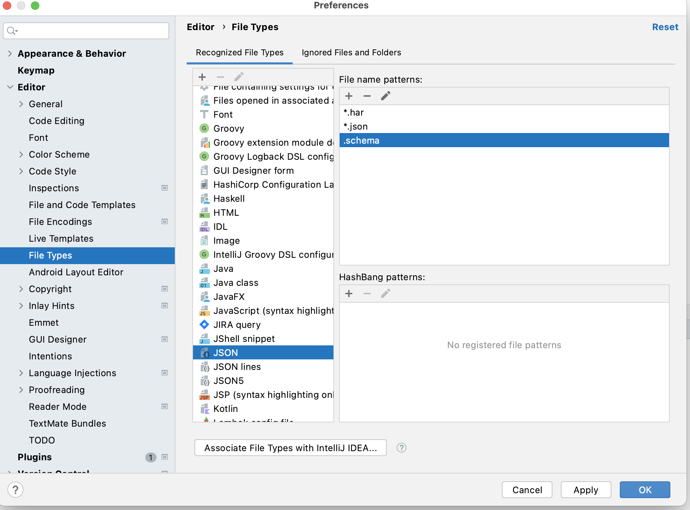

# This is a documentation for creating a blueprint in facets.

In Facets Folders play a major role in defining a blueprint. The blueprint is collection of building blocks of an product, we call the Intents.

## Intents

Intents are the specification of a job to be achieved by the stakeholder without going into the nitty gritties of implementation. For example defining an autoscaling microservice can be an intent expressed by a developer, or a qa suite to be executed for a service can be another intent by the QA team. Similarly there are a bunch of intents supported by facets. 

Each Intent belongs to a folder. And it has some central specifications and an instances folder, where you can keep adding intents of each type.

## How to read this documentation?

You can get the sense of supported intent by reading the folder name inside which you will find schema files defining all the options available in that intent.

## Stack level configurations
### Filename 
stack.json
### Schema Location
Include this in your json file to get autocomplete
```
{
"$schema": "https://docs.facets.cloud/schemas/stack.schema",
}
```

### Filename
features.json

Default feature set to enable/ disable
### Schema Location
Include this in your json file to get autocomplete
```
{
"$schema": "https://docs.facets.cloud/schemas/features.schema",
}
```

| Directory | Filename      | Description                            | Schema Location                                                                 |
|-----------|---------------|----------------------------------------|---------------------------------------------------------------------------------|
| /         | features.json | Default feature set to enable/ disable | ```"$schema": "https://docs.facets.cloud/schemas/features.schema"``` |
| /         | stack.json    | Global Variables and Secrets |    ```"$schema": "https://docs.facets.cloud/schemas/stack.schema"```                                                                             |
| /application         | sizing.{namespace}.json    | An Intent providing tshirt sizing for the applications|    ```"$schema": "https://docs.facets.cloud/schemas/application/sizing.schema"```                                                                             |
| /application/instances         | {application-name}.json    | An Intent for an application/microservice|    ```"$schema": "https://docs.facets.cloud/schemas/application/instances/application.schema"```                                                                             |
| /helm/instances         | {chart-name}.json    | An Intent for installing a helm chart|    ```"$schema": "https://docs.facets.cloud/schemas/helm/instances/helm.schema"```                                                                             |

### To enable auto complete in Intellij

Add JSON file association to .schema file like shown in the image below.



